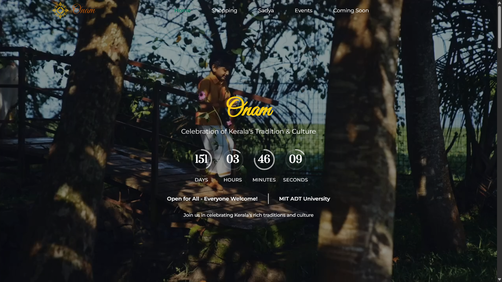
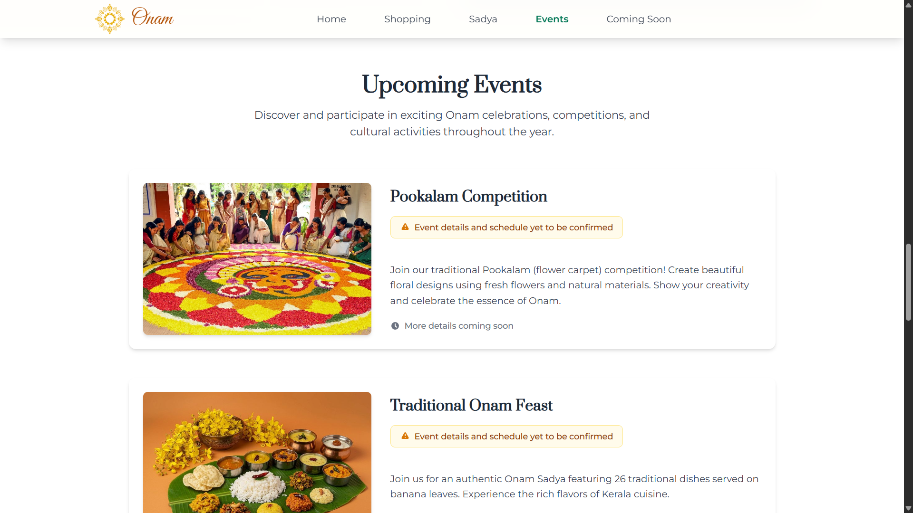
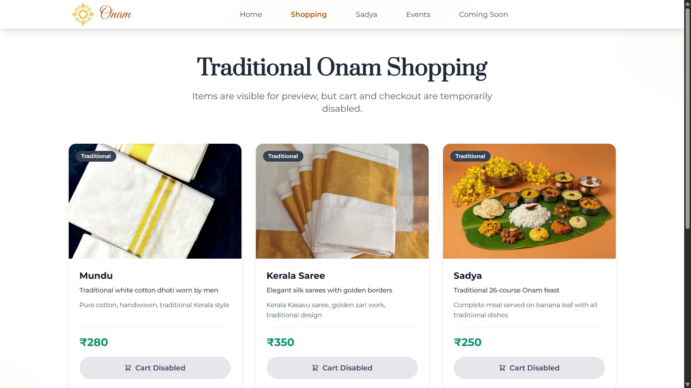

<div align="center">
  

  # Onam Festival Website

  Full-stack cultural portal for MIT ADT University Onam celebrations

  [](https://onammitadt.netlify.app)
  [](https://github.com/Gaurav-205/Onam/actions/workflows/ci.yml)
  [](https://github.com/Gaurav-205/Onam/actions/workflows/deploy.yml)
  [](https://nodejs.org)
  [](backend/package.json)
</div>

---

## Overview

This project is a full-stack Onam festival platform for MIT ADT University. It presents cultural sections, event information, a traditional shopping catalog, and backend-powered order registration with validation, persistence, and email workflows.

The cart and checkout user flow is currently disabled intentionally.

## Table of Contents

- [Overview](#overview)
- [Features](#features)
- [Tech Stack](#tech-stack)
- [Screenshots](#screenshots)
- [Quick Start](#quick-start)
- [Environment Variables](#environment-variables)
- [Project Structure](#project-structure)
- [API Routes](#api-routes)
- [Available Scripts](#available-scripts)
- [CI/CD](#cicd)
- [Deployment Checklist](#deployment-checklist)
- [Troubleshooting](#troubleshooting)
- [Roadmap](#roadmap)
- [License](#license)

---

## Features

| Module | Description |
|--------|-------------|
| Home Experience | Hero section, cultural visuals, and responsive section navigation |
| Sadya Showcase | Dedicated section for Onam feast details and media |
| Events | Event highlights and informational cards |
| Shopping Catalog | Traditional items catalog view (cart actions disabled for now) |
| Coming Soon | Placeholder area for upcoming modules |
| Order API | Backend order creation/retrieval with server-side validation |
| Email Utilities | Order confirmation and test-email endpoints with modular email service |
| Security Basics | Rate limiting, CORS controls, request IDs, and production-safe diagnostics |

---

## Tech Stack

| Layer | Technologies |
|-------|-------------|
| Frontend | React 18, Vite 7, React Router 7, Tailwind CSS 3, Vitest |
| Backend | Node.js 20, Express 4, MongoDB, Mongoose 8, Nodemailer 8, express-validator |
| Infrastructure | Netlify (frontend), Render-compatible backend, MongoDB Atlas/local MongoDB |
| CI/CD | GitHub Actions workflows at .github/workflows/ci.yml and .github/workflows/deploy.yml |

---

## Screenshots

> Screenshots below are representative. The live app at [onammitadt.netlify.app](https://onammitadt.netlify.app) reflects the current state.

| Home Page | Events Page | Shopping |
|:---:|:---:|:---:|
|  |  |  |

Additional pages like Sadya, Shopping, and Coming Soon are available through the main navigation, with responsive layouts tuned for both mobile and desktop.

---

## Quick Start

### Prerequisites

- Node.js >= 20
- npm >= 10
- MongoDB (local or Atlas)

### 1. Clone and install dependencies

```bash
git clone https://github.com/Gaurav-205/Onam.git
cd Onam

cd backend && npm install
cd ../frontend && npm install
```

### 2. Configure environment variables

Backend:

```bash
cp backend/.env.example backend/.env
```

Frontend:

```bash
cp frontend/.env.example frontend/.env
```

PowerShell (Windows) alternative:

```powershell
Copy-Item backend/.env.example backend/.env
Copy-Item frontend/.env.example frontend/.env
```

### 3. Start the app locally

```bash
# Terminal 1
cd backend && npm run dev

# Terminal 2
cd frontend && npm run dev
```

Frontend: http://localhost:5173

Backend: http://localhost:3000

Health endpoint: http://localhost:3000/health

### 4. Verify core flow

1. Open the frontend and browse Home, Events, and Shopping sections.
2. Open backend health endpoint and confirm API status is returned.
3. If checkout is intended for local testing, set `CHECKOUT_ENABLED=true` in `backend/.env`.

---

## Environment Variables

### Backend (`backend/.env`)

| Variable | Required | Description | Example |
|----------|----------|-------------|---------|
| `NODE_ENV` | No | Runtime mode (`development` or `production`) | `development` |
| `PORT` | No | Backend listening port | `3000` |
| `FRONTEND_URL` | Yes | Allowed CORS origins (comma-separated for multiple) | `http://localhost:5173,https://onammitadt.netlify.app` |
| `MONGODB_URI` | Yes | MongoDB connection string | `mongodb://localhost:27017/onam-festival` |
| `CHECKOUT_ENABLED` | No | Enables order creation route (`POST /api/orders`) | `false` |
| `UPI_ID` | Recommended | UPI target shown in config endpoint | `your-upi-id@ybl` |
| `WHATSAPP_GROUP_LINK` | Optional | Group invite link for responses/emails | `https://chat.whatsapp.com/...` |
| `EMAIL_USER` | Optional | Sender email for notifications | `example@gmail.com` |
| `EMAIL_PASSWORD` | Optional | App password/SMTP password | `xxxx xxxx xxxx xxxx` |
| `EMAIL_SERVICE` | No | Predefined service (`gmail`, `outlook`, etc.) | `gmail` |
| `EMAIL_FROM_NAME` | No | Display sender name | `Onam Festival - MIT ADT University` |
| `EMAIL_HOST` | Optional | Custom SMTP host | `smtp.example.com` |
| `EMAIL_PORT` | No | SMTP port | `587` |
| `EMAIL_SECURE` | No | Use secure SMTP (`true`/`false`) | `false` |
| `EMAIL_DEBUG` | No | Extra email debug logs | `false` |
| `LOG_LEVEL` | No | Logging verbosity | `info` |

### Frontend (`frontend/.env`)

| Variable | Required | Description | Example |
|----------|----------|-------------|---------|
| `VITE_API_BASE_URL` | Yes | Backend base URL (without forcing `/api`) | `http://localhost:3000` |

Notes:

- Frontend automatically appends `/api` where needed.
- In production, if `VITE_API_BASE_URL` is missing, frontend falls back to same-origin.

---

## Project Structure

```text
Onam/
├── .github/
│   └── workflows/
│       ├── ci.yml
│       └── deploy.yml
├── backend/
│   ├── config/
│   ├── middleware/
│   ├── models/
│   ├── routes/
│   ├── utils/
│   │   ├── email/
│   │   ├── emailService.js
│   │   ├── logger.js
│   │   └── rateLimiter.js
│   ├── scripts/
│   │   └── syntax-check.js
│   ├── server.js
│   └── package.json
├── frontend/
│   ├── public/
│   ├── scripts/
│   ├── src/
│   │   ├── components/
│   │   ├── config/
│   │   ├── constants/
│   │   ├── data/
│   │   ├── hooks/
│   │   ├── pages/
│   │   └── utils/
│   └── package.json
└── README.md
```

---

## API Routes

| Method | Path | Purpose |
|--------|------|---------|
| `GET` | `/health` | API health + database connectivity status |
| `GET` | `/api/config` | Public runtime config (`upiId`, communication links) |
| `POST` | `/api/orders` | Create a new order (disabled unless `CHECKOUT_ENABLED=true`) |
| `GET` | `/api/orders/:orderId` | Fetch order by MongoDB order id |
| `GET` | `/api/orders?studentId=...` | Query orders by `studentId`, `email`, or `status` |
| `PATCH` | `/api/orders/:orderId/status` | Update order status |
| `GET` | `/api/test-email` | Email transport diagnostic |
| `POST` | `/api/test-email-send` | Send a test email to a provided address |
| `GET` | `/api/email-diagnostics` | Safe email configuration status |

### Example: Create Order

```bash
curl -X POST http://localhost:3000/api/orders \
  -H "Content-Type: application/json" \
  -d '{
    "studentInfo": {
      "name": "Test Student",
      "studentId": "MITADT2026XYZ",
      "email": "student@example.com",
      "phone": "9876543210",
      "course": "B.Tech",
      "department": "Computer Science",
      "year": "2nd Year",
      "hostel": "Hostel A"
    },
    "orderItems": [
      {
        "id": "mundu-001",
        "name": "Mundu",
        "quantity": 1,
        "price": 280,
        "total": 280
      }
    ],
    "payment": {
      "method": "cash"
    },
    "totalAmount": 280
  }'
```

Order query notes:

- At least one query filter is required for `GET /api/orders`.
- Supported filters: `studentId`, `email`, `status`, `page`, `limit`.

---

## Available Scripts

### Frontend (`frontend/package.json`)

| Script | Description |
|--------|-------------|
| `npm run dev` | Start Vite dev server |
| `npm run build` | Create production build |
| `npm run build:prod` | Build with `NODE_ENV=production` |
| `npm run preview` | Preview built frontend |
| `npm run preview:prod` | Preview on host/port suited for deployment checks |
| `npm run lint` | Run ESLint |
| `npm test` | Run Vitest |
| `npm run test:ui` | Run Vitest UI |
| `npm run test:coverage` | Run tests with coverage |
| `npm run optimize:images` | Optimize frontend images |
| `npm run optimize:large-image` | Optimize large image assets |

### Backend (`backend/package.json`)

| Script | Description |
|--------|-------------|
| `npm run dev` | Start backend with nodemon |
| `npm start` | Start backend normally |
| `npm run prod` | Start backend in production mode |
| `npm test` | Run backend syntax checks |
| `npm run test:email` | Run email testing utility |

---

## CI/CD

| Workflow | Trigger | What it does |
|----------|---------|--------------|
| ci.yml | Push / PR to main/master | Runs backend tests and frontend lint, tests, and build |
| deploy.yml | After ci.yml success on main/master or manual run | Builds deploy artifact and prepares deployment |

---

## Deployment Checklist

Before production deployment, verify:

1. `FRONTEND_URL` includes deployed frontend origin(s).
2. `MONGODB_URI` points to production Atlas cluster.
3. `CHECKOUT_ENABLED=true` only when checkout should be publicly live.
4. `UPI_ID` is configured for payment instructions.
5. `EMAIL_USER` and `EMAIL_PASSWORD` are set if confirmations are required.
6. `/health` reports `database: connected` after deployment.

---

## Troubleshooting

### Port already in use

If backend startup reports port conflict, set a different `PORT` in `backend/.env`.

```text
PORT=3001
```

### MongoDB unavailable

If health endpoint reports degraded status, verify MongoDB is running and `MONGODB_URI` is valid.

### CORS blocked request

Add your frontend origin to `FRONTEND_URL` in `backend/.env`.

### Email diagnostics

Use these routes for safe email debugging:

- `GET /api/test-email`
- `GET /api/email-diagnostics`
- `POST /api/test-email-send`

---

## Running Checks

```bash
# Frontend
cd frontend
npm run lint
npm test
npm run build

# Backend
cd backend
npm test
```

The backend check currently validates JavaScript syntax for all backend files.

---

## Roadmap

- Re-enable cart and checkout flow when payment and operations are finalized.
- Add authenticated admin operations for order management.
- Expand automated API tests beyond syntax validation.
- Add observability dashboard metrics for production usage.

---

## License

ISC

---

<div align="center">
  Built by <a href="https://github.com/Gaurav-205">Gaurav Khandelwal</a>
</div>
